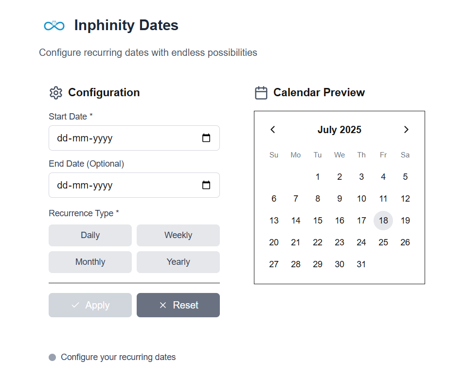

# Inphinity Dates : Recurring Date Picker

A reusable, test-driven, and accessible recurring date picker component built with Next.js, React, and Tailwind CSS. This project demonstrates modern React development patterns, including component-based architecture, state management with the Context API, and a full suite of unit and integration tests.




## Features

- **Flexible Recurrence Rules:** Supports daily, weekly, monthly, and yearly recurrences.
- **Custom Intervals:** Repeat events every 'X' days, weeks, months, or years.
- **Specific Day Selection:** For weekly recurrences, select specific days of the week (e.g., every Monday and Friday).
- **Advanced Monthly Patterns:** Configure monthly events on a specific date (e.g., the 15th) or a specific day (e.g., the second Tuesday).
- **Interactive Previews:** A live calendar highlights all generated dates for immediate visual feedback.
- **Reusable API:** The component is fully decoupled and provides its data back to any parent application via a simple `onDatesChange` callback.

## Tech Stack

- **Framework:** Next.js 14
- **Library:** React 18
- **Styling:** Tailwind CSS
- **State Management:** React Context API
- **Testing:** Jest & React Testing Library
- **Icons:** Lucide React


## Installation

Install the NPM packages:
   ```sh
   npm install
   ```

## Running the Development Server

```sh
npm run dev
```
Open [http://localhost:3000](http://localhost:3000) with browser to see the result.

## Running Tests

This project includes a full suite of unit and integration tests. To run the tests, use:
```sh
npm test
```
This command runs Jest in watch mode, which is ideal for development.

## Author
**Priyanshu Chaudhary** <br>
📧 Email: priyanshukaushal14@gmail.com <br>
🌐 LinkedIn: https://www.linkedin.com/in/priyanshu-chaudhary-1b7593255/
